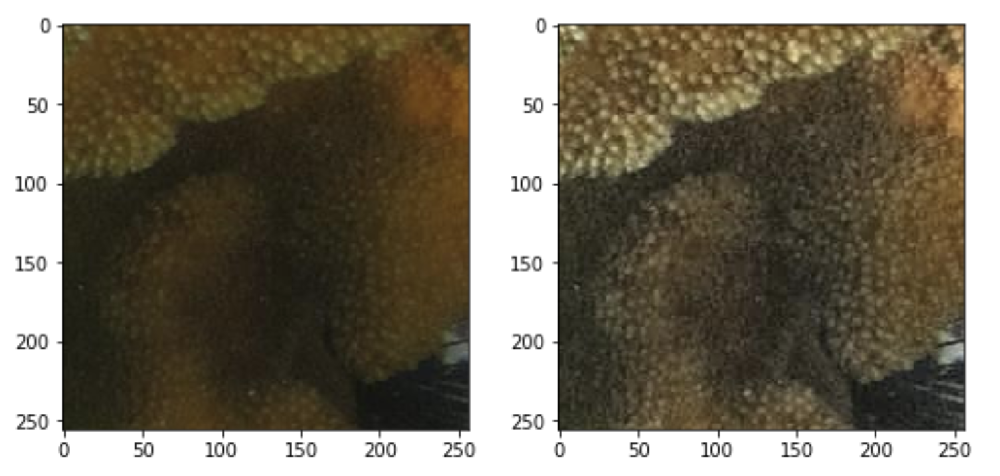
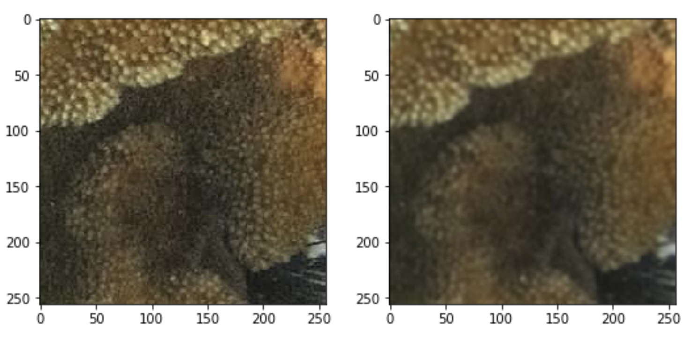
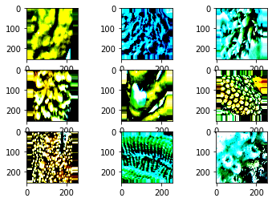
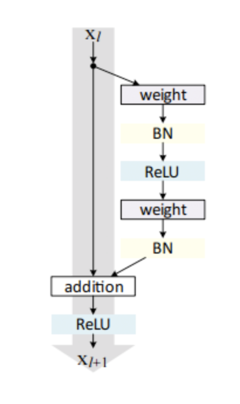
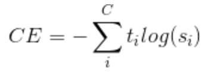

# Clasificación de corales con Transfer Learning y Fine Tuning

- [Introducción](#introducción)
  * [Conjunto de datos RSMAS](#conjunto-de-datos-rsmas)
- [Preprocesamiento utilizado](#preprocesamiento-utilizado)
  * [Corrección de la luminosidad de las imágenes](#corrección-de-la-luminosidad-de-las-imágenes)
  * [Desenfoque Gaussiano](#desenfoque-gaussiano)
  * [Data augmentation](#data-augmentation)
- [Modelos utilizados](#modelos-utilizados)
  * [VGG-16](#vgg-16)
  * [Resnet-50](#resnet-50)
  * [Xception](#xception)
- [Tuning de los hiperparámetros de la red](#tuning-de-los-hiperparámetros-de-la-red)
  * [Configuración capas del modelo](#configuración-capas-del-modelo)
  * [Función de coste](#función-de-coste)
  * [Selección del optimizador](#selección-del-optimizador)
  * [Callback](#callback)
  * [Tratamiento del balanceo de clases](#tratamiento-del-balanceo-de-clases)
- [Resultados](#resultados)
  * [Pruebas iniciales (Inception, VGG-16)](#pruebas-iniciales)
  * [VGG-16](#vgg-16-1)
  * [Resnet-50](#resnet-50-1)
  * [Xception](#xception-1)
  * [Resultados de los mejores envíos](#resultados-de-los-mejores-envíos)

# Introducción

El documento que a continuación se presenta se corresponde con la memoria final generada para tras la competición de Kaggle de clasificación de corales del conjunto de datos RSMAS, para la asignatura de Minería de Datos: Aspectos Avanzados, del máster universitario de Ciencia de Datos e Ingeniería de Computadores, de la Universidad de Granada. En esta competición se exige el uso de Deep Learning o Aprendizaje Profundo, a fin de a raíz de un conjunto de imágenes de corales de distintas clases, intentar generar modelos que maximicen la exactitud en la clasificación de otras imágenes del mismo conjunto a priori que no han sido vistas por parte del modelo de Deep Learning. 

La librería de que ha utilizado para desarrollar los modelos que se presentan en esta práctica es la API de alto nivel de redes neuronales Keras, la cual implementa un conjunto de funcionalidades que facilitan el desarrollo de arquitecturas de redes neuronales y su correcto entrenamiento y ajuste. Así, la principal aproximación utilizada para el desarrollo de modelos y que en buena medida, también facilita Keras, ha sido la generación de modelos por medio de Transfer Learning y Fine Tuning.

Este informe pretende dejar constancia del trabajo realizado por los componentes del grupo de LaGuaguaTeam, de forma que a lo largo de estas páginas se intentarán detallar aquellas tareas que se han realizado durante las distintas fases de la competición y que han derivado en unos resultados que también se exponen en este documento. Cabe recordar los miembros del equipo de LaGuaguaTeam:

* **Juan Isern** - *Initial work* - [JuanIsernGhosn](https://github.com/JuanIsernGhosn/)
* **José Daniel Déniz Cerpa** - *Initial work* - [DaniDeniz](https://github.com/DaniDeniz/)
* **Francisco Carrillo Pérez** - *Initial work* - [Pacocp](https://github.com/Pacocp/)
* **José Daniel Pascual Triana**


## Conjunto de datos RSMAS

Actualmente, existen ocho puntos de referencia abiertos que se utilizan para la clasificación de los corales subacuáticos. En esta competición se ha utilizado el conjunto RSMAS, uno de los conjuntos de datos RGB más recientes y que contienen mayor número de corales. Este conjuntos de datos se componen de imágenes de partes de corales, las cuales capturan de forma principal la textura de las mismas más que la estructura global del coral en cuestión.
Así, el conjunto de imágenes RSMAS contiene 766 imágenes de tamaño 256×256. Las imágenes fueron recolectadas por buzos de la Rosenstiel School of Marine and Atmospheric Science, de la universidad de Miami. Estas imágenes fueron tomadas con diferentes cámaras en diferentes lugares y han sido clasificadas en 14 clases, cuyas etiquetas corresponden a los nombres de las especies de coral en latín. En la Figura 1 se muestran varias imágenes del conjunto de datos. Para la competición, se ha dividido el conjunto de imágenes RSMAS de la siguiente forma:

* Un subconjunto de entrenamiento, formado por 620 imágenes del conjunto original y cuya distribución por clases es la siguiente:

    * ACER: 88
    * APAL: 62
    * CNAT: 46
    * DANT: 51
    * DSTR: 20
    * GORG: 48
    * MALC: 18
    * MCAV: 64
    * MMEA: 44
    * MONT: 23
    * PALY: 26
    * SPO: 71
    * SSID: 30
    * TUNI: 29

* Un subconjunto de test, formado por las 146 imágenes restantes del conjunto de datos. A su vez, este subconjunto de test se ha dividido en otros dos:

    * Un 29% del mismo se utiliza para la clasificación pública durante la competición, de forma que se puede observar el rendimiento del modelo y tener una idea del potencial respecto al del resto de competidores.
    * El otro 71% se utiliza para la clasificación privada, que es liberada una vez finalizada la competición, de forma que con él se puede tener una idea de la capacidad de generalización de los modelos generados sobre datos anteriormente no testados.
    
# Preprocesamiento utilizado

A fin de facilitar el aprendizaje de nuestro modelo, se han llevado a cabo diversas tareas de preprocesamiento sobre nuestras imágenes. Así, en este epígrafe se presentan dichas tareas, incidiendo en la relevancia de estas, por qué se han planteado y cómo se han desarrollado.

## Corrección de la luminosidad de las imágenes

Tras llevar a cabo una primera visualización de las imágenes, nos percatamos que en algunas clases había ciertas imágenes que, por sus condiciones de captura, dificultaban la visualización de ciertos detalles y que por lo tanto, no permitían extraer una información que pudiera considerarse del todo representativa de la clase en cuestión, fuera por la luz tenue con la que había sido tomada la imagen o por el excesivo brillo presente en la imagen.
	
Así y para poder solucionar este problema, se corrigió la intensidad de las imágenes. Para ello y en un primer momento, se cambió el espacio de color con el cual estaban cargadas las imágenes (originalmente en RGB) a YCrCb, donde el canal Y representa la componente de luma o luminosidad de la imagen, mientras que Cb y Cr son las componentes de crominancia diferencia de azul y diferencia de rojo. Este cambio de espacio de color se llevó a cabo por medio de una de las funciones de OpenCV y la línea en cuestión se muestra a continuación:


```python
img_YCrCb = cv2.cvtColor(img,cv2.COLOR_BGR2YCrCb)
```

La técnica que se utilizó para mejorar el contraste de nuestras imágenes fue la ecualización del histograma. Esta es una transformación que pretende obtener para una imagen un histograma con una distribución uniforme. Concretamente, nosotros hicimos uso de un algoritmo denominado CLAHE (Contrast Limited Adaptive Histogram Equalization) y su implementación concreta de OpenCV. 

Para esta ecualización adaptativa del histograma, la imagen se divide en pequeños bloques (8x8 por defecto en OpenCV). Luego, cada uno de estos bloques son ecualizados de manera individual por lo que en un área pequeña, el histograma se limitaría a una región pequeña. Además, para evitar amplificar ruido existente, se aplica una limitación de contraste, de forma que si en alguna de las celdas del histograma está por encima del límite de contraste especificado (por defecto 40 en OpenCV), estos píxeles se recortan y distribuyen uniformemente en otras celdas. Las líneas de código necesarias para llevar a cabo este preprocesamiento son las mostradas a continuación:


```python
clahe = cv2.createCLAHE(clipLimit=5, tileGridSize=(8,8))
cl1 = clahe.apply(img_YCrCb[:,:,0])
img_YCrCb[:,:,0] = cl1
img_RGB = cv2.cvtColor(img_YCrCb, cv2.COLOR_YCrCb2RGB)
```

A continuación, en la Figura 1 se muestra una de las imágenes del conjunto de entrenamiento antes y después de la corrección del contraste:


<center>Figura 1. Imagen antes y después de la corrección del contraste</center>

## Desenfoque Gaussiano

Tal y como ya hemos comentado en el epígrafe anterior, tras llevar a cabo la corrección de intensidad de los colores de las imágenes, se pudo apreciar un incremento en el detallismo de las texturas de los corales y en el desempeño de nuestros modelos. Si bien esto es positivo, pues la imagen de con la que se entrena nuestro modelo es de mayor calidad, también es sabido que esto puede resultar en un sobreajuste del modelo, más aún en un conjunto de datos de tamaño tan reducido.

Por ello, se aplicó un desenfoque gaussiano a las imágenes, a fin de que los bordes y los detalles no estuvieran tan definidos y permitieran una mejor generalización del modelo. Al revisar bibliografía, se llegó a la conclusión que esta técnica ha probado ser de gran utilidad en el preprocesamiento de las imágenes en tareas de visión por computador, y concretamente en redes neuronales y, por último, en Deep Learning. La función de desenfoque gaussiano utilizada es la implementada por OpenCV y la línea concreta de código realizada es la siguiente:


```python
cv2.GaussianBlur(img_RGB,(5,5),0)
```

A continuación, en la Figura 2 se muestra una imagen del conjunto de entrenamiento antes y después del desenfoque gaussiano:


<center>Figura 2. Imagen antes y después del desenfoque gaussiano</center>

## Data augmentation

En primer lugar, una de las primeras aproximaciones que se han utilizado ha sido la generación de nuevas imágenes de manera sintética mediante distintas transformaciones de las imágenes originales. Esta técnica se conoce habitualmente como Data Augmentation y su uso resulta bastante común, sobretodo en situaciones en las que el tamaño del dataset es muy pequeño, lo que hace que sea difícil que nuestro modelo sea capaz de describir la totalidad del dominio que subyace a nuestro problema de clasificación y que, por lo tanto, tienda al sobreajuste.

En la librería Keras, la realización del Data Augmentation es relativamente simple, pues tiene implementado un objeto ImageDataGenerator, el cual como su nombre indica, genera dinámicamente imágenes en el proceso de entrenamiento del modelo, siguiendo las transformaciones indicadas como parámetros en su instanciación. A continuación, se muestra como ejemplo la instanciación de un objeto ImageDataGenerator con los parámetros que se han utilizado durante la competición en las distintas entregas:


```python
datagen = ImageDataGenerator(
    featurewise_center = True,
    featurewise_std_normalization = True,
    rescale = 1.0/255,
    zoom_range = x,
    rotation_range = y,
    horizontal_flip = True,
    validation_split = 0.2
)
```

Cada uno de los distintos parámetros, así como valores con los que se han probado, se describen a continuación:

* **featurewise_center**: Establece la media de los datos a 0, restando la media de las variables a nivel de conjunto de datos.
* **featurewise_std_normalization**: Divide los datos por la desviación estándar de las variables a nivel de conjunto de datos.
* **rescale**: Con este parámetro, se multiplican cada uno de los valores de los píxeles de la imagen por una constante pasada. En nuestro caso, las veces que hemos utilizado esta opción ha sido para incluir los datos de cada imagen en un intervalo [0,1], para lo cual ha sido necesario multiplicar estos por el inverso del valor máximo posible en un canal RGB: 1/255.
* **zoom_range**: Consiste en hacer zoom de manera aleatoria en la imagen en un rango determinado. Así pues, dado x, cada imagen se redimensiona en el intervalo [1-x,1+x]. Los valores de zoom probados han sido de 0.2, 0.3 y 0.4, obteniendo los mejores resultados con el segundo valor.
* **rotation_range**: Esta transformación consiste en girar aleatoriamente las imágenes en un ángulo que como máximo será el pasado por parámetro. Dado un valor y, cada imagen se gira en un ángulo contenido en el intervalo [0, y].
* **horizontal_flip**: Consiste en voltear las imágenes horizontalmente de forma aleatoria.
* **validation_split**: Define el porcentaje del conjunto de datos que será utilizado para validación tras cada época. Debido al tamaño del conjunto de imágenes, se estableció a 0.2 a fin de que hubiesen varias imágenes de las mismas clases.

Si bien en el objeto anterior permite llevar a cabo una estandarización de los datos de entrenamiento a la hora de realizar el Data Augmentation, del mismo modo, ha de realizarse una normalización de los datos de prueba de manera que se encuentren centrados y escalados de la misma forma y que permita que las predicciones se puedan realizar correctamente. Así, esta transformación sobre los datos de prueba se ha realizado como se indica a continuación:


```python
x_test = (x_test - datagen.mean)/(datagen.std + 0.000001)
```

A continuación, en la Figura 3 se muestra un conjunto de imágenes generadas sintéticamente a raíz de la aplicación de las transformaciones anteriormente comentadas sobre imágenes a las que les fue normalizadas su intensidad y a las que le fue aplicadas un filtro gaussiano.


<center>Figura 3. Nueve imágenes generadas por Data Augmentation (Keras)</center>

# Modelos utilizados

Cómo se ha indicado anteriormente en la sección de Introducción, una de las ventajas que hemos aprovechado de las técnicas de Deep Learning es la capacidad de poder realizar Transfer Learning. Con esta técnica lo que conseguimos es aprovecharnos de las características que han extraído las capas convolucionales en otro problema donde la cantidad de datos fuese superior, y entrenar las capas finales para nuestro problema. Esta técnica es ampliamente utilizada y lleva a unos muy buenos resultados en una variedad de problemas.

Para aprovechar esta técnica hemos hecho uso de tres modelos ampliamente utilizados en la literatura: VGG-16, Resnet-50 y Xception.

## VGG-16

La red VGG fue propuesta por Simonyan y Zisserman en su artículo de 2014 *Very Deep Convolutional Networks for Large Scale Image Recognition*.

Esta red se caracteriza por su simplicidad. Se compone de capas de convolución con kernels de 3x3 una encima de la otra. Además, se va reduciendo la dimensionalidad con una capa de MaxPooling. Por último, dos capas de 4096 neuronas seguidas de una capa densa para la salida con una función de activación Softmax.

Para hacer uso de lo aprendido en otro conjunto de datos es necesario añadir capas nuevas sobre esta arquitectura, que serán las que entrenaremos. También se probó a reentrenar algunas de las capas convolucionales del modelo pero se obtuvieron peores resultados. Las capas que hemos añadido son las siguientes:

* **Global Avarage Pooling**: Esta capa ha sido utilizada en los últimos años como una técnica de prevención de overfitting. Lo que realiza es una reducción de las dimensiones que se encuentren en la capa anterior, llamemoslas (h x w x d) a (1 x 1 x d).  Para ello lo que se realiza es, para cada filtro de tamaño (h x w), una media para dejarlo en un único valor. De esta forma reducimos también el número de parámetros de la red.
* **Dropout**:  Esta capa es también una ampliamente utilizada para reducir el sobreajuste. En cada iteración un porcentaje N aleatorio de conexiones entre las neuronas de las capas densas se bloquea, de forma que no todas se conectarán con todas. Los rangos entre que nos movimos fueron entre 0.25 y 0.5.
* **Densa**: Una capa densa de N neuronas. Estas N neuronas se eligieron en el proceso de tuning de los hiperparámetros. Los rangos entre los que nos movimos fueron entre 512 y 1024.
* **Dropout**:  Otra capa de Dropout para evitar más el sobreajuste que pueda existir.
* **Densa**: Una capa densa de N neuronas. Estas N neuronas se eligieron en el proceso de tuning de los hiperparámetros. Los rangos entre los que nos movimos fueron entre 512 y 1024.
* **Densa**: La capa de salida con 14 neuronas una por clase.


<center>Figura 4. Ejemplo de la arquitectura VGG-16</center>

## Resnet-50

A diferencia de las arquitecturas de red secuenciales tradicionales como AlexNet, OverFeat y VGG, ResNet es en cambio una forma que se basa en módulos de microarquitectura (también llamados "arquitecturas de red dentro de red").
El término microarquitectura se refiere al conjunto de "bloques" utilizados para construir la red. Una colección de “bloques” de microarquitectura (junto con sus capas estándar de convolución, pooling, etc.) conduce a la macroarquitectura (es decir, la propia red final).

Introducido por primera vez por He et al. en su artículo de 2015, Deep Residual Learning for Image Recognition, la arquitectura de ResNet se ha convertido en un trabajo fundamental, demostrando que las redes extremadamente profundas pueden ser entrenadas usando SGD estándar (y una función de inicialización razonable) mediante el uso de módulos residuales.

Al igual que con la arquitectura VGG-16, aquí también se añadieron las capas descritas anteriormente. Estas capas fueron las entrenadas para nuestro problema concreto.


<center>Figura 5. Ejemplo de bloque residual propuesto por He et. al. en 2015</center>

## Xception

Xception es una arquitectura presentada por F. Chollet, creador de Keras, en 2017. Estaba basada en la arquitectura Inception V3, presentada por Google para la competición de Imagenet. Sin embargo, Xception presenta algunas modificaciones que permiten que se mejoren los resultados obtenidos por Inception V3 reduciendo el número de parámetros que se usaban en Inception V3.

Para ello se modifica un elemento de Inception V3, *Depthwise Separable Convolution*. Este bloque se compone de unas convoluciones de (nxn) que luego vienen seguidas de una convolución de 1x1. Sin embargo, en Xception, el orden se altera. Primero se aplica la convolución de 1x1 para la luego aplicar las convoluciones de (nxn). Además, entre las convoluciones no se aplica ninguna función de activación. Esto llevó al autor a mejores resultados en los conjuntos de datos.

Al igual que con las dos arquitecturas anteriores, se usaron capas finales sobre el modelo que fueron las capas entrenadas.


<center>Figura 6. Arquitectura de Xception presentada por F. Chollet</center>

# Tuning de los hiperparámetros de la red

En relación con el tuning de los diferentes hiperparámetros que pueden configurarse para optimizar el rendimiento de los distintos modelos generados, se procedió con diferentes pruebas, entre las que se destaca el ajuste de algunas capas de las redes preentrenadas nombradas en el anterior apartado, el diseño de las últimas capas del modelo, la selección del optimizador a utilizar, así como la función de coste definida en cada caso.

## Configuración capas del modelo

Debido a que han realizado pruebas por medio tanto de Transfer Learning, así como de Fine Tuning sobre los modelos anteriores. En la mayoría de los casos se ha procedido con el congelado de las primeras capas, ya que estas son las que suelen extraer características más generales de las imágenes, y se ha procedido con el reentrenado de los últimos bloques de capas convolucionales, e incluso, se han añadido también algunas nuevas capas por nuestra parte para que la arquitectura del modelo pudiese representar y generalizar en mayor medida el problema, ya que como se disponía de un número muy bajo de ejemplos, hubo que recurrir a las técnicas previamente mencionadas. Esta parte de la arquitectura de los modelos estaría relacionada con la parte de extracción de características de las imágenes. 

Por otra parte, en cuanto al apartado de las capas densas, o fully connected layers que se encargan de realizar la clasificación en función de la salida de las capas anteriores, se caracterizó principalmente por estar formado por una capa de Global Average Poling para unir el resultado provisto por las capas previas, capas de Dropout, las cuales tienen la función de eliminar conexiones entre neuronas de distintas capas con la finalidad de conseguir una mayor generalización, así como capas densas con varias neuronas, teniendo como última capa una densa con una función de activación softmax para distinguir entre las 14 clases de este problema. En general en todas que se han añadido se ha utilizado relu como función de activación. En el siguiente epígrafe donde se describa cómo se han conseguido los mejores resultados se expondrá de forma más concreta la configuración de la red realizada.

## Función de coste

Principalmente se ha hecho uso en todas las pruebas de la función de coste categorical cross entropy (Ecuación 1), debido a que ha ofrecido buenos resultados en problemas en los que se está tratando clasificación de múltiples clases, ya que evita la ralentización del aprendizaje, de forma que el descenso del gradiente depende tan solo de la salida de la neurona, la entrada de la misma y la clase del ejemplo mal clasificado. Con esto por tanto se evita la ralentización del aprendizaje y ayuda con el problema de desaparición del gradiente que sufren las redes neuronales profundas.


<center>Ecuación 1: Categorical Cross Entropy Loss function</center>

## Selección del optimizador

En cuanto al optimizador de la red, se han realizado pruebas con diferentes aproximaciones, en las que se ha procurado en todo momento que se realice un buen ajuste de los parámetros de la red para que resulte un buen modelo.
Principalmente se hizo uso de dos optimizadores con los siguientes parámetros: 

* Adam
    * lr = 0.001, 0.0001, 0.00001 y 0.000001
* SGD
    * lr = 0.01, 0.001
    * momentum = 0.9
    * decay = 1e-6
    * nesterov = True, False

En cuanto a Adam, en este se fue disminuyendo progresivamente el valor de learning rate debido a que al decrementarse se consigue que el aprendizaje se haga de una manera más progresiva al problema a través de la función de coste, evitando de esta manera un sobreajuste del modelo, así como el asentarse en mínimos locales.

Por otra parte, en relación con SGD (Stochastic Gradient Descent), no se definió un learning rate tan bajo como el anterior de base. Pero se probó estableciendo un momentum de 0.9 para configurar la media móvil de los gradientes. Con decay se actualiza el valor de learning rate disminuyendo de la forma indicada en cada época, lo que propicia a realizar un aprendizaje más rápido al inicio, y se ralentiza a medida que sucede cada época para intentar generalizar bien el modelo. Por último, en cuanto a nesterov, se indica si se aplica el momentum de nesterov para el gradiente o no. 

Finalmente, para intentar lograr que en primera instancia se proceda con un aprendizaje más rápido y que progresivamente fuese más despacio, es decir, que en las últimas épocas el modelo se ajuste bien por medio de la función de coste de manera que se consiga lograr una buena generalización, se realiza una modificación del learning rate a medida que sucede cada época.

## Callback

En el callback se ha establecido un EarlyStopping que monitorice el valor de la función de coste sobre el conjunto de validación (20% del  conjunto original de train) de forma que cuando este deje de disminuir de manera constante considerando un valor de paciencia, se pare el entrenamiento del modelo. Esto se realiza para tratar de evitar el sobreajuste del modelo, de forma que se pueda identificar en qué momento se ha entrenado tanto el modelo que se ha adaptado en gran medida a los datos de entrenamiento y se muestra un claro sobreajuste al evaluarlo sobre el conjunto de validación. Además de esto, se ha establecido el parámetro de restore_best_weights, de manera que el modelo final estará compuesto por aquellos pesos que han ofrecido un valor de coste más bajo sobre el conjunto de validación.

## Tratamiento del balanceo de clases

En este problema se observó la existencia de una claro desbalanceo entre clases y para combatir este hecho se trató de abordar por medio del establecimiento de pesos sobre aquellas clases que se considerasen minoritarias, para que así cuando el clasificador las asignase en una clase errónea, esto tuviese mayor importancia que cuando clasificase de manera errónea cualquier ejemplo de una clase mayoritaria. Si bien esto se llevó a cabo tratando de equilibrar el peso del error de cada ejemplo en función del número de instancias de cada clase, la mejora producida en el modelo final no fue significativa en gran medida ya que ofreció resultados similares a cuando no se aplicaba esta técnica.

# Resultados

A continuación, se explica la estructura concreta de distintos envíos realizados y se valoran los resultados obtenidos por los mismos.

## Pruebas iniciales

Las primeras redes presentaron unos resultados muy bajos, en parte por ser simples pruebas para comprobar cómo se comportan los algoritmos de base, pero también por el hecho de que las subidas de predicciones a la plataforma Kaggle no fueron del todo correctas, debido a que aún si bien estas se suben con un formato <ID, Predicción>, el orden de las predicciones influye en la evaluación por parte de Kaggle, cuando intuitivamente se podría pensar que debiera hacer uso del ID de cara a evaluar cada predicción.

## VGG-16

Inicialmente, se probó utilizando SGD (que daba malos resultados) y ADAM, generando nuevos ejemplos de training mediante zooms y simetrías y entrenando todas las capas o bien sólo las últimas (a partir del 4.º bloque). Viendo que al reentrenar todas las capas en cada paso no aportaba mejoras, se pasó a entrenar sólo las capas finales y a añadir capas nuevas.

Los primeros intentos de añadir capas propias fueron añadiendo una convolucional, un dropout, un flatten y 2 densas en un caso (da un resultado similar al no modificado) y añadiendo una capa de flatten y 3 densas, que sí mejora ligeramente el aprendizaje, aunque todavía se sitúa por debajo del 90%.

Seguidamente, se probó con un average pooling y dos parejas de capas dropout-densa, con una capa final que usaba softmax, obteniendo ya resultados por encima del 90% (envio3.csv).

En cuanto a la condición de parada, la paciencia de la red se mantuvo alta (se para al empeorar en 20 pasos seguidos). Al añadir preprocesamiento, corrigiendo el brillo en RGB y en YCrCb, así como incluyendo otras restricciones para la parada temprana en el entrenamiento (que no se produzca pérdida de información en 3 casos seguidos), la precisión del modelo superó el 95% (envio4.csv).

En la siguiente prueba, se probó a bajar el rango de zoom a cambio de poder truncar la imagen en la generación de muestras y bajando la paciencia del modelo a la hora de decidir la parada del entrenamiento a 15 epochs seguidos, manteniendo el resto igual. Esto cual produjo resultados sólo ligeramente inferiores (envio6.csv). Sin embargo, al reducir incluso más esa paciencia (10 epochs) el resultado mejoró considerablemente, alcanzando el 100% de acierto en la clasificación pública (envio7.csv).

Para el siguiente envío se probó a añadir el desenfoque gaussiano a las imágenes en el preprocesamiento, antes de los ajustes de los colores, lo cual ayudaba a reducir el sobreentrenamiento que parecía estar ocurriendo y mejoraba el resultado privado sin empeorar el público (**envio8.csv**).

Para el siguiente envío entregado, se probó a eliminar la corrección en RGB (manteniendo la YCrCb) y a añadir una nueva pareja dropout-densa para el entrenamiento, aunque el resultado empeora ligeramente (envio11.csv).
Visto ese resultado, se opta por eliminar la pareja dropout-densa añadida en el caso anterior, y a añadir en el preprocesamiento pesos diferenciados para las clases con más datos y las de menos, de forma que el nuevo modelo intentara incorporar mejor las clases minoritarias (envio12.csv). El cambio empeora bastante el resultado, aunque la idea de los pesos no se descartó.

Las siguientes 3 entregas (**envio19.csv**, envio17.csv y envio18.csv) añaden la rotación de las imágenes para la generación de nuevos ejemplos, aunque lo fundamental es que cambian los bloques de aprendizaje de la red. Eliminan los bloques a partir del 4.º (inclusive) de VGG-16 y añadiendo nodos propios. En concreto, esos bloques se sustituyen por una capa de dropout, 3 convolucionales, un batch normalization, un max pooling y un dropout, antes de volver con el average pooling, las 2 parejas dropout-dense y la softmax que ya se habían añadido para las redes anteriores. En el caso del envio19.csv, que tenía un ángulo de rotación más amplio, el resultado obtenido fue muy bueno (por encima del 97% tanto en el score público como en el privado).

Modificando los pesos y los distintos parámetros sobre el modelo de la entrega envio19.csv, lo más que se consiguió fue igualar los resultados, sin mejorarlos (**envio19_pesos_2.0_zoom_0.3_rotacion_0.7.csv**).

## Resnet-50

Para estas redes, el preprocesamiento utilizado es similar al de las últimas pruebas de VGG-16. Se utilizan las técnicas de desenfoque gaussiano, corrección de color en RGB e YCrCb y grids para la corrección de la iluminación, se normalizan los datos (como siempre) y, para generar nuevos ejemplos para el aprendizaje, se usan los datos centrados con zoom y simetrías.

En este caso, la arquitectura base de la red es distinta, formada por multitud de bloques con bifurcaciones, en vez de seguir siempre un mismo camino. Como en el caso de VGG-16, se añadieron un average pooling, 2 parejas dropout-densa y una softmax al final del modelo, reentrenando sólo las capas que incluyen medias y varianzas móviles y las últimas 15 capas. La condición de parada es la misma que la usada en VGG-16, con una paciencia de 10.
Utilizando esta estructura, se obtuvieron algunos buenos resultados (por ejemplo, el envio.csv que se marcó con Resnet50, con 100% de accuracy el el test público y 96% en el privado), pero no superaron al mejor caso de VGG-16.

## Xception

Para estas redes se usó el mismo preprocesamiento que para RESNET50, aunque añadiendo un parámetro de rotación de hasta 1 grado a la hora de generar nuevas muestras de entrenamiento.

Al igual que antes, sobre el modelo base de Xception se añaden como capas de transfer learning un average pooling, 2 parejas dropout-densa y una softmax. Sólo se reentrenan las capas finales y las que incluyen medias y varianzas móviles, y la condición de parada es similar al caso de RESNET50.

La entrega realizada utilizando esta estructura obtuvo los mejores resultados de score privado (>99%), y si bien en el caso público obtuvo un buen resultado, no fue perfecto (>95%) (**envio.csv Xception_Keras_11-J**).

## Resultados de los mejores envíos

Los envíos seleccionados para la entrega final son los que se destacaron en las explicaciones anteriores, que se pueden encontrar (junto con sus scores) en la tabla siguiente:

| Envío                                       | Score privado | Score público |
|---------------------------------------------|:-------------:|:-------------:|
| envio.csv Xception_Keras_11-J               |    0.99038    |    0.95238    |
| envio19.csv                                 |    0.98076    |    0.97619    |
| envio19_pesos_2.0_zoom_0.3_rotacion_0.7.csv |    0.98076    |    0.97619    |
| envio8.csv                                  |    0.96153    |    1.00000    |
